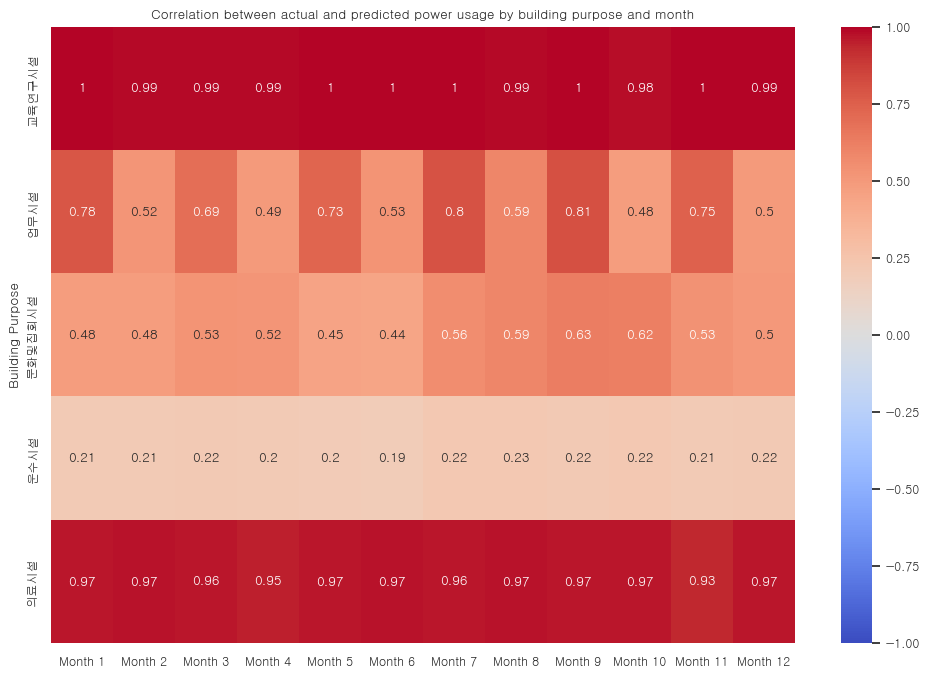
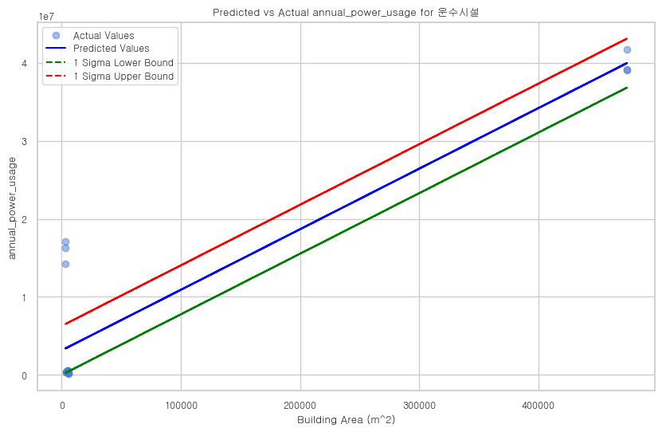

# 1. Libraty Setting

```python
import sys

# 필요한 라이브러리 리스트
libraries = ["pandas", "matplotlib", "sqlalchemy", "seaborn", "numpy", "scipy", 'pygwalker','missingno', 'scikit-learn', 'psycopg2']

# 설치되지 않은 라이브러리 리스트
not_installed = []

# 라이브러리 설치 여부 확인
for library in libraries:
    try:
        __import__(library)
    except ImportError:
        not_installed.append(library)

# 설치되지 않은 라이브러리가 있을 경우 pip로 설치
if not_installed:
    !pip install {" ".join(not_installed)}

from DatabaseManager import DatabaseManager
from DataProcessor import DataProcessor
from Visualizer import Visualizer
```

    Requirement already satisfied: scikit-learn in c:\users\jusuk\anaconda3\envs\waterenergy\lib\site-packages (1.3.0)
    Requirement already satisfied: numpy>=1.17.3 in c:\users\jusuk\anaconda3\envs\waterenergy\lib\site-packages (from scikit-learn) (1.25.2)
    Requirement already satisfied: scipy>=1.5.0 in c:\users\jusuk\anaconda3\envs\waterenergy\lib\site-packages (from scikit-learn) (1.11.2)
    Requirement already satisfied: joblib>=1.1.1 in c:\users\jusuk\anaconda3\envs\waterenergy\lib\site-packages (from scikit-learn) (1.3.2)
    Requirement already satisfied: threadpoolctl>=2.0.0 in c:\users\jusuk\anaconda3\envs\waterenergy\lib\site-packages (from scikit-learn) (3.2.0)


```python
%load_ext autoreload
%autoreload 2
from DatabaseManager import DatabaseManager
from DataAnalyzer import DataAnalyzer, CorrelationAnalyzer
from DataProcessor import DataProcessor
from Visualizer import Visualizer
import pandas as pd
import matplotlib.pyplot as plt
from matplotlib import font_manager, rc 
import seaborn as sns
import numpy as np
from sklearn.cluster import KMeans
from sklearn.linear_model import LinearRegression
from sklearn.metrics import mean_squared_error, r2_score
from scipy.stats import linregress
import pygwalker as pyg
import missingno as msno
import warnings
from pylab import rcParams
warnings.simplefilter(action='ignore', category=UserWarning)
pd.set_option('display.max_seq_items', None)
import warnings
warnings.filterwarnings('ignore')
```

    The autoreload extension is already loaded. To reload it, use:
      %reload_ext autoreload


# 2. Data Load


```python
# Create a DatabaseManager instance
db = DatabaseManager("db_config.json")

# Define the SQL query
sql_query = sql_query = """
Select *
from "data_bld_waterusage_Goyang";
"""

# Execute a query to get the data
df_raw_data = db.execute_query(sql_query)
DF = df_raw_data
DF_dtypes = df_raw_data.dtypes
```

    <class 'pandas.core.frame.DataFrame'>


```python
# seoul_2020, seoul_2021, seoul_2022 데이터 로드
try:
    seoul_2020 = pd.read_csv('./rawdata/seoul_csv/seoul_2020.csv', encoding='cp949', delimiter='\t', low_memory=False)
    seoul_2021 = pd.read_csv('./rawdata/seoul_csv/seoul_2021.csv', encoding='cp949', low_memory=False)
    seoul_2022 = pd.read_csv('./rawdata/seoul_csv/seoul_2022.csv', encoding='cp949', low_memory=False)
    
    # 합치기
    combined_data = pd.concat([seoul_2020, seoul_2021, seoul_2022], ignore_index=True)
    
    
except Exception as e:
    error_message = str(e)
    print(error_message)
```


```python
# 콤마 제거
for col in combined_data.columns:
    if combined_data[col].dtype == 'object':
        combined_data[col] = combined_data[col].str.replace('"', '').str.replace(',', '')

# 고양시 데이터 타입과 동일하게 설정
for col in DF.columns:
    if col in combined_data.columns:
        if DF_dtypes[col] == 'int64' and combined_data[col].isnull().any():
            combined_data[col] = combined_data[col].astype('float64')
        else:
            combined_data[col] = combined_data[col].astype(DF_dtypes[col])

combined_data['bld_purpose'] = combined_data['bld_purpose'].astype('object')
Seoul_df_raw_data = combined_data
```


```python
df_selected_data = Seoul_df_raw_data[['bld_pk', 'usage_year', 'bld_purpose', 'nm_buinding', 'loc_road', 'bld_area',
        'bld_area_ratio', 'bld_coord_x', 'bld_coord_y', 'usage_m1', 'usage_m2',
        'usage_m3', 'usage_m4', 'usage_m5', 'usage_m6', 'usage_m7', 'usage_m8',
        'usage_m9', 'usage_m10', 'usage_m11', 'usage_m12', 'power_m1', 'power_m2', 'power_m3',
        'power_m4', 'power_m5', 'power_m6', 'power_m7', 'power_m8', 'power_m9',
        'power_m10', 'power_m11', 'power_m12']]     
```


```python
msno.matrix(df_selected_data)
```


    <Axes: >


    

    


# 3. Data Pre-treatment


```python
# 연도별, 용도별 정의 
usage_years = ['2020','2021','2022']
bld_purpose = ['업무시설','교육연구시설', '문화및집회시설', '의료시설', '운수시설']

seasons = {
    'WaterUsage_SpringFall': ['usage_m3', 'usage_m4', 'usage_m5', 'usage_m9', 'usage_m10'],
    'WaterUsage_Summer': ['usage_m6', 'usage_m7', 'usage_m8'],
    'WaterUsage_Winter': ['usage_m1', 'usage_m2', 'usage_m11', 'usage_m12'],
    'PowerUsage_SpringFall': ['power_m3', 'power_m4', 'power_m5', 'power_m9', 'power_m10'],
    'PowerUsage_Summer': ['power_m6', 'power_m7', 'power_m8'],
    'PowerUsage_Winter': ['power_m1', 'power_m2', 'power_m11', 'power_m12'],
    'PowerUsage_per_WaterUsage_SpringFall': ['power_m3_per_usage_m3', 'power_m4_per_usage_m4', 'power_m5_per_usage_m5', 'power_m9_per_usage_m9', 'power_m10_per_usage_m10'],
    'PowerUsage_per_WaterUsage_Summer': ['power_m6_per_usage_m6', 'power_m7_per_usage_m7', 'power_m8_per_usage_m8'],
    'PowerUsage_per_WaterUsage_Winter': ['power_m1_per_usage_m1', 'power_m2_per_usage_m2', 'power_m11_per_usage_m11', 'power_m12_per_usage_m12']                   
}
seasons_per_area = {
    'WaterUsagePerArea_SpringFall': ['usage_m3_per_area', 'usage_m4_per_area', 'usage_m5_per_area', 'usage_m9_per_area', 'usage_m10_per_area'],
    'WaterUsagePerArea_Summer': ['usage_m6_per_area', 'usage_m7_per_area', 'usage_m8_per_area'],
    'WaterUsagePerArea_Winter': ['usage_m1_per_area', 'usage_m2_per_area', 'usage_m11_per_area', 'usage_m12_per_area'],
    'PowerUsagePerArea_SpringFall': ['power_m3_per_area', 'power_m4_per_area', 'power_m5_per_area', 'power_m9_per_area', 'power_m10_per_area'],
    'PowerUsagePerArea_Summer': ['power_m6_per_area', 'power_m7_per_area', 'power_m8_per_area'],
    'PowerUsagePerArea_Winter': ['power_m1_per_area', 'power_m2_per_area', 'power_m11_per_area', 'power_m12_per_area'],
    'PowerPerWaterUsagePerArea_SpringFall': ['power_m3_per_usage_m3_per_area', 'power_m4_per_usage_m4_per_area', 'power_m5_per_usage_m5_per_area', 'power_m9_per_usage_m9_per_area', 'power_m10_per_usage_m10_per_area'],
    'PowerPerWaterUsagePerArea_Summer': ['power_m6_per_usage_m6_per_area', 'power_m7_per_usage_m7_per_area', 'power_m8_per_usage_m8_per_area'],
    'PowerPerWaterUsagePerArea_Winter': ['power_m1_per_usage_m1_per_area', 'power_m2_per_usage_m2_per_area', 'power_m11_per_usage_m11_per_area', 'power_m12_per_usage_m12_per_area']
}
seoul_districts = ["강남구","강동구","강북구","강서구","관악구","광진구","구로구","금천구","노원구","도봉구","동대문구","동작구","마포구","서대문구", "서초구",
                   "성동구","성북구","송파구","양천구","영등포구","용산구","은평구","종로구","중구","중랑구"]
```


```python
# Null 전처리 및 월별 사용량을 연간 사용량으로 변환 후 추가

df = df_selected_data.copy()
df['usage_year'] = df['usage_year'].astype(str)

# 연도별 데이터 프레임을 저장할 딕셔너리 초기화
yearly_prepreprocess_dataframes = {}
for year in usage_years:
    processor = DataProcessor(df)
    # 연도별 생성 테이블 정의
    table_name = f"preprocessdata_{year}"    
    
    # 데이터 전처리
    df_preprocessing_data = processor.preprocess_data(year, bld_purpose, seasons, seasons_per_area)
    
    # 연도별로 데이터 프레임을 딕셔너리에 저장
    yearly_prepreprocess_dataframes[year] = df_preprocessing_data
    
    # 연도별로 데이터 프레임을 DB에 저장    
    db.write_to_db(df_preprocessing_data, table_name=table_name, if_exists='replace')  
```

    
    
    초기 행의 수: 1647
    제거된 행의 수: 1436
    남은 행의 수: 211
    
    
    초기 행의 수: 1647
    제거된 행의 수: 1447
    남은 행의 수: 200
    
    
    초기 행의 수: 1647
    제거된 행의 수: 1437
    남은 행의 수: 210


```python
# 전처리 데이터 합치기
df_combined_preprocessing_data = pd.concat([yearly_prepreprocess_dataframes['2020'],
                          yearly_prepreprocess_dataframes['2021'],
                          yearly_prepreprocess_dataframes['2022']], ignore_index=True)
df_combined_preprocessing_data
# 전처리 데이터 DB 저장
db = DatabaseManager("db_config.json")
db.write_to_db(df_combined_preprocessing_data, table_name='combined_prerocessing_data_Seoul', if_exists='replace')
# csv 저장
df_combined_preprocessing_data.to_csv('./csv/combined_preprocessing_data_Seoul.csv')
seoul_data = df_combined_preprocessing_data
```


```python
msno.matrix(seoul_data)
```


    <Axes: >


    

    


```python
seoul_data.describe()
```


<div>
<style scoped>
    .dataframe tbody tr th:only-of-type {
        vertical-align: middle;
    }

    .dataframe tbody tr th {
        vertical-align: top;
    }

    .dataframe thead th {
        text-align: right;
    }
</style>
<table border="1" class="dataframe">
  <thead>
    <tr style="text-align: right;">
      <th></th>
      <th>bld_area</th>
      <th>bld_area_ratio</th>
      <th>bld_coord_x</th>
      <th>bld_coord_y</th>
      <th>usage_m1</th>
      <th>usage_m2</th>
      <th>usage_m3</th>
      <th>usage_m4</th>
      <th>usage_m5</th>
      <th>usage_m6</th>
      <th>...</th>
      <th>PowerUsage_per_WaterUsage_Winter</th>
      <th>WaterUsagePerArea_SpringFall</th>
      <th>WaterUsagePerArea_Summer</th>
      <th>WaterUsagePerArea_Winter</th>
      <th>PowerUsagePerArea_SpringFall</th>
      <th>PowerUsagePerArea_Summer</th>
      <th>PowerUsagePerArea_Winter</th>
      <th>PowerPerWaterUsagePerArea_SpringFall</th>
      <th>PowerPerWaterUsagePerArea_Summer</th>
      <th>PowerPerWaterUsagePerArea_Winter</th>
    </tr>
  </thead>
  <tbody>
    <tr>
      <th>count</th>
      <td>6.210000e+02</td>
      <td>6.210000e+02</td>
      <td>621.000000</td>
      <td>621.000000</td>
      <td>621.000000</td>
      <td>621.000000</td>
      <td>621.000000</td>
      <td>621.000000</td>
      <td>621.000000</td>
      <td>621.000000</td>
      <td>...</td>
      <td>621.000000</td>
      <td>621.000000</td>
      <td>621.000000</td>
      <td>621.000000</td>
      <td>621.000000</td>
      <td>621.000000</td>
      <td>621.000000</td>
      <td>621.000000</td>
      <td>621.000000</td>
      <td>621.000000</td>
    </tr>
    <tr>
      <th>mean</th>
      <td>3.186879e+04</td>
      <td>2.098224e+04</td>
      <td>126.382248</td>
      <td>37.365865</td>
      <td>2367.885668</td>
      <td>2439.175523</td>
      <td>2381.930757</td>
      <td>2271.212560</td>
      <td>2349.732689</td>
      <td>2498.381643</td>
      <td>...</td>
      <td>3866.027016</td>
      <td>0.461914</td>
      <td>0.300849</td>
      <td>0.375720</td>
      <td>51.052523</td>
      <td>35.260796</td>
      <td>50.136223</td>
      <td>0.291001</td>
      <td>0.170393</td>
      <td>0.318688</td>
    </tr>
    <tr>
      <th>std</th>
      <td>1.110280e+05</td>
      <td>8.276908e+04</td>
      <td>8.812920</td>
      <td>2.605893</td>
      <td>11113.471736</td>
      <td>10939.557491</td>
      <td>11695.321113</td>
      <td>10665.943834</td>
      <td>11399.320576</td>
      <td>11493.652004</td>
      <td>...</td>
      <td>29850.235340</td>
      <td>0.891502</td>
      <td>0.596229</td>
      <td>0.760678</td>
      <td>135.881673</td>
      <td>87.034388</td>
      <td>136.497671</td>
      <td>1.111743</td>
      <td>0.565773</td>
      <td>1.476269</td>
    </tr>
    <tr>
      <th>min</th>
      <td>8.716100e+02</td>
      <td>0.000000e+00</td>
      <td>0.000000</td>
      <td>0.000000</td>
      <td>1.000000</td>
      <td>1.000000</td>
      <td>2.000000</td>
      <td>1.000000</td>
      <td>3.000000</td>
      <td>3.000000</td>
      <td>...</td>
      <td>1.111098</td>
      <td>0.000788</td>
      <td>0.000585</td>
      <td>0.000375</td>
      <td>0.060020</td>
      <td>0.036673</td>
      <td>0.048897</td>
      <td>0.000046</td>
      <td>0.000022</td>
      <td>0.000037</td>
    </tr>
    <tr>
      <th>25%</th>
      <td>5.111360e+03</td>
      <td>3.311580e+03</td>
      <td>126.944987</td>
      <td>37.511874</td>
      <td>215.000000</td>
      <td>215.000000</td>
      <td>202.000000</td>
      <td>194.000000</td>
      <td>202.000000</td>
      <td>218.000000</td>
      <td>...</td>
      <td>405.797974</td>
      <td>0.152309</td>
      <td>0.093507</td>
      <td>0.122275</td>
      <td>23.456927</td>
      <td>16.537549</td>
      <td>24.673890</td>
      <td>0.020045</td>
      <td>0.013918</td>
      <td>0.020120</td>
    </tr>
    <tr>
      <th>50%</th>
      <td>9.716380e+03</td>
      <td>6.122125e+03</td>
      <td>126.998836</td>
      <td>37.547922</td>
      <td>507.000000</td>
      <td>506.000000</td>
      <td>501.000000</td>
      <td>450.000000</td>
      <td>468.000000</td>
      <td>503.000000</td>
      <td>...</td>
      <td>672.672082</td>
      <td>0.272823</td>
      <td>0.173370</td>
      <td>0.209802</td>
      <td>32.802031</td>
      <td>22.551441</td>
      <td>32.798637</td>
      <td>0.062000</td>
      <td>0.037800</td>
      <td>0.061908</td>
    </tr>
    <tr>
      <th>75%</th>
      <td>2.641578e+04</td>
      <td>1.847205e+04</td>
      <td>127.055245</td>
      <td>37.573207</td>
      <td>1432.000000</td>
      <td>1448.000000</td>
      <td>1350.000000</td>
      <td>1264.000000</td>
      <td>1345.000000</td>
      <td>1441.000000</td>
      <td>...</td>
      <td>1173.835997</td>
      <td>0.451270</td>
      <td>0.299744</td>
      <td>0.365047</td>
      <td>46.889506</td>
      <td>32.914158</td>
      <td>43.767632</td>
      <td>0.153025</td>
      <td>0.088757</td>
      <td>0.157846</td>
    </tr>
    <tr>
      <th>max</th>
      <td>1.469057e+06</td>
      <td>1.134571e+06</td>
      <td>127.159754</td>
      <td>37.657949</td>
      <td>148288.000000</td>
      <td>149931.000000</td>
      <td>163292.000000</td>
      <td>152756.000000</td>
      <td>154341.000000</td>
      <td>161224.000000</td>
      <td>...</td>
      <td>660340.333333</td>
      <td>9.168639</td>
      <td>5.725452</td>
      <td>9.129062</td>
      <td>2037.046161</td>
      <td>1275.741060</td>
      <td>2020.558777</td>
      <td>19.608537</td>
      <td>6.321899</td>
      <td>30.962790</td>
    </tr>
  </tbody>
</table>
<p>8 rows × 100 columns</p>
</div>


```python
bld_purpose_list = ['업무시설', '교육연구시설', '문화및집회시설', '의료시설', '운수시설']
filtered_data = seoul_data[seoul_data['bld_purpose'].isin(bld_purpose_list)]
bld_purpose_counts = filtered_data['bld_purpose'].value_counts()
bld_purpose_counts
```


    bld_purpose
    업무시설       338
    교육연구시설     125
    문화및집회시설    104
    의료시설        36
    운수시설        18
    Name: count, dtype: int64


```python
# Define building purposes
bld_purposes = ['교육연구시설', '업무시설', '문화및집회시설', '운수시설', '의료시설']

# Filter the data for required building purposes
filtered_data = seoul_data[seoul_data['bld_purpose'].isin(bld_purposes)].copy()

# Recompute WCSS values for the elbow method
purpose_wcss = {}
for purpose in bld_purposes:
    subset = filtered_data[filtered_data['bld_purpose'] == purpose]
    wcss = []
    for n in range(1, 6):
        kmeans = KMeans(n_clusters=n, n_init=10, init='k-means++', random_state=42)
        kmeans.fit(subset[['bld_area']])
        wcss.append(kmeans.inertia_)
    purpose_wcss[purpose] = wcss

# Find optimal number of clusters using the elbow method
optimal_clusters = {}
for purpose, wcss in purpose_wcss.items():
    differences = np.diff(wcss)
    optimal_clusters[purpose] = np.argmin(differences) + 2

# Plotting the WCSS for each building purpose with the optimal number of clusters highlighted
fig, axes = plt.subplots(nrows=len(bld_purposes), ncols=1, figsize=(10, 15))

for idx, purpose in enumerate(bld_purposes):
    axes[idx].plot(range(1, 6), purpose_wcss[purpose], marker='o', linestyle='--')
    axes[idx].axvline(x=optimal_clusters[purpose], color='r', linestyle='--')
    axes[idx].set_title(f"Elbow Method for {purpose}")
    axes[idx].set_xlabel('Number of clusters')
    axes[idx].set_ylabel('WCSS')
    axes[idx].set_xticks(range(1, 6))

plt.tight_layout()
plt.show()

optimal_clusters_df = pd.DataFrame(list(optimal_clusters.items()), columns=['Building Purpose', 'Optimal Number of Clusters'])
```


    

    


```python
# Filter out the "업무시설" data from the main dataset
filepath = './csv/combined_preprocessing_data_Seoul.csv'
analyzer = DataAnalyzer(filepath)
loaded_data = analyzer.data
bld_list = loaded_data['bld_purpose'].unique()

for bld_purpose in bld_list:
    office_data_main = loaded_data[loaded_data['bld_purpose'] == bld_purpose]

    # Plot the distribution of building areas for "업무시설" based on cluster names
    plt.figure(figsize=(10, 6))
    sns.boxplot(data=office_data_main, x='cluster_name', y='bld_area')
    plt.title(f"Building Area Distribution for {bld_purpose} by Cluster Name")
    plt.ylabel("Building Area (m^2)")
    plt.xlabel("Cluster Name")
    plt.show()
```


    

    


    

    


    

    


    

    


    

    


```python
loaded_data.to_csv('./csv/combined_preprocessing_data_Seoul.csv')
seoul_data = loaded_data
```


```python
filepath = './csv/combined_preprocessing_data_Seoul.csv'
analyzer = DataAnalyzer(filepath)
analyzer.cluster_data()
```


<div>
<style scoped>
    .dataframe tbody tr th:only-of-type {
        vertical-align: middle;
    }

    .dataframe tbody tr th {
        vertical-align: top;
    }

    .dataframe thead th {
        text-align: right;
    }
</style>
<table border="1" class="dataframe">
  <thead>
    <tr style="text-align: right;">
      <th></th>
      <th>Building Purpose</th>
      <th>Cluster Name</th>
      <th>Building Area</th>
      <th>Count</th>
    </tr>
  </thead>
  <tbody>
    <tr>
      <th>0</th>
      <td>교육연구시설</td>
      <td>소형건물</td>
      <td>2.392235e+04</td>
      <td>99</td>
    </tr>
    <tr>
      <th>1</th>
      <td>교육연구시설</td>
      <td>대형건물</td>
      <td>1.469057e+06</td>
      <td>26</td>
    </tr>
    <tr>
      <th>2</th>
      <td>문화및집회시설</td>
      <td>소형건물</td>
      <td>9.683536e+03</td>
      <td>50</td>
    </tr>
    <tr>
      <th>3</th>
      <td>문화및집회시설</td>
      <td>대형건물</td>
      <td>4.744427e+04</td>
      <td>54</td>
    </tr>
    <tr>
      <th>4</th>
      <td>업무시설</td>
      <td>소형건물</td>
      <td>1.113755e+04</td>
      <td>178</td>
    </tr>
    <tr>
      <th>5</th>
      <td>업무시설</td>
      <td>대형건물</td>
      <td>5.672334e+04</td>
      <td>160</td>
    </tr>
    <tr>
      <th>6</th>
      <td>운수시설</td>
      <td>소형건물</td>
      <td>4.692100e+03</td>
      <td>6</td>
    </tr>
    <tr>
      <th>7</th>
      <td>운수시설</td>
      <td>대형건물</td>
      <td>4.739735e+05</td>
      <td>12</td>
    </tr>
    <tr>
      <th>8</th>
      <td>의료시설</td>
      <td>소형건물</td>
      <td>5.710235e+04</td>
      <td>21</td>
    </tr>
    <tr>
      <th>9</th>
      <td>의료시설</td>
      <td>대형건물</td>
      <td>2.832251e+05</td>
      <td>15</td>
    </tr>
  </tbody>
</table>
</div>


# 4. Data Analyzer

# 4.1 Water - Energy Corr.

### 4.1.1 Method


```python
# CorrelationAnalyzer 인스턴스 생성
correlation_analyzer = CorrelationAnalyzer(analyzer.data) 
correlation_analyzer.visualize_monthly_correlation_v3()

results=correlation_analyzer.visualize_monthly_correlation_slope()
df_slope=pd.DataFrame(results)
df_slope
```


    

    


<div>
<style scoped>
    .dataframe tbody tr th:only-of-type {
        vertical-align: middle;
    }

    .dataframe tbody tr th {
        vertical-align: top;
    }

    .dataframe thead th {
        text-align: right;
    }
</style>
<table border="1" class="dataframe">
  <thead>
    <tr style="text-align: right;">
      <th></th>
      <th>교육연구시설</th>
      <th>업무시설</th>
      <th>문화및집회시설</th>
      <th>운수시설</th>
      <th>의료시설</th>
    </tr>
  </thead>
  <tbody>
    <tr>
      <th>Month 1 Slope</th>
      <td>132.202720</td>
      <td>137.606945</td>
      <td>48.429970</td>
      <td>-3.900747e+02</td>
      <td>115.510680</td>
    </tr>
    <tr>
      <th>Month 1 Intercept</th>
      <td>25493.415594</td>
      <td>38815.633082</td>
      <td>92566.336673</td>
      <td>1.112390e+06</td>
      <td>-43949.182984</td>
    </tr>
    <tr>
      <th>Month 2 Slope</th>
      <td>135.518442</td>
      <td>63.739587</td>
      <td>47.066104</td>
      <td>-3.495363e+02</td>
      <td>104.675326</td>
    </tr>
    <tr>
      <th>Month 2 Intercept</th>
      <td>-5756.633559</td>
      <td>98225.176716</td>
      <td>88285.147266</td>
      <td>9.814708e+05</td>
      <td>-32853.754216</td>
    </tr>
    <tr>
      <th>Month 3 Slope</th>
      <td>101.939231</td>
      <td>96.565493</td>
      <td>46.519109</td>
      <td>-4.355925e+02</td>
      <td>103.548403</td>
    </tr>
    <tr>
      <th>Month 3 Intercept</th>
      <td>49437.910846</td>
      <td>50444.453290</td>
      <td>62674.115954</td>
      <td>9.793953e+05</td>
      <td>-100733.373661</td>
    </tr>
    <tr>
      <th>Month 4 Slope</th>
      <td>102.882747</td>
      <td>54.303029</td>
      <td>48.797061</td>
      <td>-4.302708e+02</td>
      <td>104.999230</td>
    </tr>
    <tr>
      <th>Month 4 Intercept</th>
      <td>15997.682204</td>
      <td>79172.700340</td>
      <td>52312.559703</td>
      <td>8.814019e+05</td>
      <td>-47793.203679</td>
    </tr>
    <tr>
      <th>Month 5 Slope</th>
      <td>81.966683</td>
      <td>113.575473</td>
      <td>37.249724</td>
      <td>-3.274034e+02</td>
      <td>120.459327</td>
    </tr>
    <tr>
      <th>Month 5 Intercept</th>
      <td>13970.491765</td>
      <td>18313.182367</td>
      <td>54099.794717</td>
      <td>9.183193e+05</td>
      <td>-193420.969410</td>
    </tr>
    <tr>
      <th>Month 6 Slope</th>
      <td>89.891376</td>
      <td>73.334222</td>
      <td>47.987583</td>
      <td>-3.486964e+02</td>
      <td>135.671190</td>
    </tr>
    <tr>
      <th>Month 6 Intercept</th>
      <td>-2241.266141</td>
      <td>71348.701423</td>
      <td>70437.843414</td>
      <td>1.021193e+06</td>
      <td>-181992.837172</td>
    </tr>
    <tr>
      <th>Month 7 Slope</th>
      <td>104.418305</td>
      <td>160.222335</td>
      <td>66.629631</td>
      <td>-2.970979e+02</td>
      <td>135.674189</td>
    </tr>
    <tr>
      <th>Month 7 Intercept</th>
      <td>10434.261726</td>
      <td>7371.770222</td>
      <td>74005.186934</td>
      <td>1.164072e+06</td>
      <td>-178438.047396</td>
    </tr>
    <tr>
      <th>Month 8 Slope</th>
      <td>109.066353</td>
      <td>74.319095</td>
      <td>74.110916</td>
      <td>-2.997613e+02</td>
      <td>133.511790</td>
    </tr>
    <tr>
      <th>Month 8 Intercept</th>
      <td>-16261.594066</td>
      <td>89276.927799</td>
      <td>78926.767406</td>
      <td>1.220605e+06</td>
      <td>-165585.187219</td>
    </tr>
    <tr>
      <th>Month 9 Slope</th>
      <td>95.649776</td>
      <td>120.310328</td>
      <td>50.497930</td>
      <td>-2.428358e+02</td>
      <td>87.515962</td>
    </tr>
    <tr>
      <th>Month 9 Intercept</th>
      <td>13602.809989</td>
      <td>14631.297043</td>
      <td>68217.562807</td>
      <td>1.044349e+06</td>
      <td>-88974.053210</td>
    </tr>
    <tr>
      <th>Month 10 Slope</th>
      <td>88.275578</td>
      <td>47.947380</td>
      <td>45.461367</td>
      <td>-2.627284e+02</td>
      <td>88.869269</td>
    </tr>
    <tr>
      <th>Month 10 Intercept</th>
      <td>-3395.099977</td>
      <td>77156.106652</td>
      <td>53928.103115</td>
      <td>9.322906e+05</td>
      <td>-84887.314736</td>
    </tr>
    <tr>
      <th>Month 11 Slope</th>
      <td>86.089798</td>
      <td>107.019405</td>
      <td>35.551658</td>
      <td>-1.995752e+02</td>
      <td>107.619342</td>
    </tr>
    <tr>
      <th>Month 11 Intercept</th>
      <td>11514.467758</td>
      <td>22434.632945</td>
      <td>61875.955245</td>
      <td>8.866723e+05</td>
      <td>-141278.600376</td>
    </tr>
    <tr>
      <th>Month 12 Slope</th>
      <td>109.823336</td>
      <td>64.419335</td>
      <td>41.589554</td>
      <td>-2.786409e+02</td>
      <td>113.675666</td>
    </tr>
    <tr>
      <th>Month 12 Intercept</th>
      <td>2558.452458</td>
      <td>93996.281681</td>
      <td>81043.263835</td>
      <td>1.066117e+06</td>
      <td>-96046.201384</td>
    </tr>
  </tbody>
</table>
</div>


### 4.1.2 Result


```python
# 용도별 회귀식 매핑 테이블 생성
results_df_monthly_correlation_and_r2 =correlation_analyzer.dataframe_compute_monthly_correlation_and_r2()
results_df_monthly_correlation_and_r2.to_csv('./csv/results_monthly_regression.csv')
results_df_monthly_correlation_and_r2
```


<div>
<style scoped>
    .dataframe tbody tr th:only-of-type {
        vertical-align: middle;
    }

    .dataframe tbody tr th {
        vertical-align: top;
    }

    .dataframe thead th {
        text-align: right;
    }
</style>
<table border="1" class="dataframe">
  <thead>
    <tr style="text-align: right;">
      <th></th>
      <th>Building Purpose</th>
      <th>Month</th>
      <th>Correlation</th>
      <th>R^2</th>
      <th>Count</th>
      <th>Regression Equation</th>
      <th>Slope</th>
      <th>Intercept</th>
    </tr>
  </thead>
  <tbody>
    <tr>
      <th>0</th>
      <td>교육연구시설</td>
      <td>1</td>
      <td>0.995520</td>
      <td>0.991060</td>
      <td>125</td>
      <td>y = 132.20x + 25493.42</td>
      <td>132.202720</td>
      <td>2.549342e+04</td>
    </tr>
    <tr>
      <th>1</th>
      <td>교육연구시설</td>
      <td>2</td>
      <td>0.989716</td>
      <td>0.979538</td>
      <td>125</td>
      <td>y = 135.52x + -5756.63</td>
      <td>135.518442</td>
      <td>-5.756634e+03</td>
    </tr>
    <tr>
      <th>2</th>
      <td>교육연구시설</td>
      <td>3</td>
      <td>0.991215</td>
      <td>0.982508</td>
      <td>125</td>
      <td>y = 101.94x + 49437.91</td>
      <td>101.939231</td>
      <td>4.943791e+04</td>
    </tr>
    <tr>
      <th>3</th>
      <td>교육연구시설</td>
      <td>4</td>
      <td>0.988864</td>
      <td>0.977853</td>
      <td>125</td>
      <td>y = 102.88x + 15997.68</td>
      <td>102.882747</td>
      <td>1.599768e+04</td>
    </tr>
    <tr>
      <th>4</th>
      <td>교육연구시설</td>
      <td>5</td>
      <td>0.997170</td>
      <td>0.994349</td>
      <td>125</td>
      <td>y = 81.97x + 13970.49</td>
      <td>81.966683</td>
      <td>1.397049e+04</td>
    </tr>
    <tr>
      <th>...</th>
      <td>...</td>
      <td>...</td>
      <td>...</td>
      <td>...</td>
      <td>...</td>
      <td>...</td>
      <td>...</td>
      <td>...</td>
    </tr>
    <tr>
      <th>75</th>
      <td>의료시설</td>
      <td>12</td>
      <td>0.965898</td>
      <td>0.932959</td>
      <td>36</td>
      <td>y = 113.68x + -96046.20</td>
      <td>113.675666</td>
      <td>-9.604620e+04</td>
    </tr>
    <tr>
      <th>76</th>
      <td>의료시설</td>
      <td>Yearly</td>
      <td>0.972141</td>
      <td>0.945058</td>
      <td>36</td>
      <td>y = 113.27x + -1607601.85</td>
      <td>113.271003</td>
      <td>-1.607602e+06</td>
    </tr>
    <tr>
      <th>77</th>
      <td>의료시설</td>
      <td>SpringFall</td>
      <td>0.968495</td>
      <td>0.937982</td>
      <td>36</td>
      <td>y = 100.12x + -576594.51</td>
      <td>100.117907</td>
      <td>-5.765945e+05</td>
    </tr>
    <tr>
      <th>78</th>
      <td>의료시설</td>
      <td>Summer</td>
      <td>0.972792</td>
      <td>0.946324</td>
      <td>36</td>
      <td>y = 135.54x + -552716.61</td>
      <td>135.535070</td>
      <td>-5.527166e+05</td>
    </tr>
    <tr>
      <th>79</th>
      <td>의료시설</td>
      <td>Winter</td>
      <td>0.970816</td>
      <td>0.942483</td>
      <td>36</td>
      <td>y = 112.86x + -441595.03</td>
      <td>112.863277</td>
      <td>-4.415950e+05</td>
    </tr>
  </tbody>
</table>
<p>80 rows × 8 columns</p>
</div>


```python
# 용도별 회귀식 매핑 테이블을 이용한 예측 전력 데이터 생성 (pred_power_m{month})
slope_intercept_mapping = results_df_monthly_correlation_and_r2.set_index(["Building Purpose", "Month"])[["Slope", "Intercept"]].to_dict(orient="index")

# 월별 사용량 예측
for month in range(1, 13):
    analyzer.data[f"pred_power_m{month}"] = analyzer.data.apply(
        lambda row: row[f"usage_m{month}"] * slope_intercept_mapping.get((row['bld_purpose'], month), {}).get('Slope', 0) 
                    + slope_intercept_mapping.get((row['bld_purpose'], month), {}).get('Intercept', 0), axis=1
    )

# 연도별 사용량 예측
annual_column = ['Yearly', 'SpringFall', 'Summer', 'Winter']
for cnt, annuals in enumerate(annual_column):
    analyzer.data[f"pred_power_yearly"] = analyzer.data.apply(
            lambda row: row[f"annual_water_usage"] * slope_intercept_mapping.get((row['bld_purpose'], annuals), {}).get('Slope', 0) 
                        + slope_intercept_mapping.get((row['bld_purpose'], annuals), {}).get('Intercept', 0), axis=1
        )
    
analyzer.data.to_csv('./csv/add_error.csv')
```


```python
analyzer.data
```


<div>
<style scoped>
    .dataframe tbody tr th:only-of-type {
        vertical-align: middle;
    }

    .dataframe tbody tr th {
        vertical-align: top;
    }

    .dataframe thead th {
        text-align: right;
    }
</style>
<table border="1" class="dataframe">
  <thead>
    <tr style="text-align: right;">
      <th></th>
      <th>Unnamed: 0.1</th>
      <th>Unnamed: 0</th>
      <th>bld_pk</th>
      <th>usage_year</th>
      <th>bld_purpose</th>
      <th>nm_buinding</th>
      <th>loc_road</th>
      <th>bld_area</th>
      <th>bld_area_ratio</th>
      <th>bld_coord_x</th>
      <th>...</th>
      <th>pred_power_m4</th>
      <th>pred_power_m5</th>
      <th>pred_power_m6</th>
      <th>pred_power_m7</th>
      <th>pred_power_m8</th>
      <th>pred_power_m9</th>
      <th>pred_power_m10</th>
      <th>pred_power_m11</th>
      <th>pred_power_m12</th>
      <th>pred_power_yearly</th>
    </tr>
  </thead>
  <tbody>
    <tr>
      <th>0</th>
      <td>0</td>
      <td>0</td>
      <td>11680-4600</td>
      <td>2020</td>
      <td>업무시설</td>
      <td>NaN</td>
      <td>서울특별시 강남구 개포로 621</td>
      <td>43745.41</td>
      <td>25191.07</td>
      <td>127.078673</td>
      <td>...</td>
      <td>196630.151447</td>
      <td>197308.128290</td>
      <td>184650.075124</td>
      <td>372999.138570</td>
      <td>270912.796641</td>
      <td>400947.759917</td>
      <td>202778.243483</td>
      <td>245249.034343</td>
      <td>226635.693200</td>
      <td>3.098761e+06</td>
    </tr>
    <tr>
      <th>1</th>
      <td>1</td>
      <td>1</td>
      <td>11680-12084</td>
      <td>2020</td>
      <td>문화및집회시설</td>
      <td>논현1문화센터</td>
      <td>서울특별시 강남구 학동로20길 25</td>
      <td>4003.31</td>
      <td>2465.71</td>
      <td>127.028528</td>
      <td>...</td>
      <td>67000.475143</td>
      <td>63710.223540</td>
      <td>82578.701795</td>
      <td>96392.743114</td>
      <td>105606.697182</td>
      <td>84881.879584</td>
      <td>66202.672275</td>
      <td>71474.902852</td>
      <td>92106.085245</td>
      <td>5.030592e+05</td>
    </tr>
    <tr>
      <th>2</th>
      <td>2</td>
      <td>2</td>
      <td>11680-17499</td>
      <td>2020</td>
      <td>업무시설</td>
      <td>삼원빌딩</td>
      <td>서울특별시 강남구 언주로 651</td>
      <td>7080.39</td>
      <td>5248.86</td>
      <td>127.034943</td>
      <td>...</td>
      <td>128479.850412</td>
      <td>254777.317780</td>
      <td>131922.769175</td>
      <td>392225.818763</td>
      <td>164487.852213</td>
      <td>371351.419255</td>
      <td>143611.175983</td>
      <td>276819.758844</td>
      <td>157127.230340</td>
      <td>2.336253e+06</td>
    </tr>
    <tr>
      <th>3</th>
      <td>3</td>
      <td>3</td>
      <td>11680-16399</td>
      <td>2020</td>
      <td>업무시설</td>
      <td>NaN</td>
      <td>서울특별시 강남구 도산대로 128</td>
      <td>15328.31</td>
      <td>9638.41</td>
      <td>127.022535</td>
      <td>...</td>
      <td>144119.122681</td>
      <td>164939.118399</td>
      <td>164116.492835</td>
      <td>126897.632092</td>
      <td>148732.204016</td>
      <td>202315.408561</td>
      <td>138145.174609</td>
      <td>216995.911399</td>
      <td>209757.827334</td>
      <td>1.862397e+06</td>
    </tr>
    <tr>
      <th>4</th>
      <td>4</td>
      <td>4</td>
      <td>11680-19158</td>
      <td>2020</td>
      <td>업무시설</td>
      <td>NaN</td>
      <td>서울특별시 강남구 언주로 721</td>
      <td>26261.50</td>
      <td>21442.23</td>
      <td>127.033519</td>
      <td>...</td>
      <td>137819.971350</td>
      <td>153240.844649</td>
      <td>154509.709693</td>
      <td>213417.692963</td>
      <td>179203.033077</td>
      <td>137588.452153</td>
      <td>130665.383256</td>
      <td>119180.175147</td>
      <td>159059.810401</td>
      <td>1.578767e+06</td>
    </tr>
    <tr>
      <th>...</th>
      <td>...</td>
      <td>...</td>
      <td>...</td>
      <td>...</td>
      <td>...</td>
      <td>...</td>
      <td>...</td>
      <td>...</td>
      <td>...</td>
      <td>...</td>
      <td>...</td>
      <td>...</td>
      <td>...</td>
      <td>...</td>
      <td>...</td>
      <td>...</td>
      <td>...</td>
      <td>...</td>
      <td>...</td>
      <td>...</td>
      <td>...</td>
    </tr>
    <tr>
      <th>616</th>
      <td>616</td>
      <td>616</td>
      <td>11140-9652</td>
      <td>2022</td>
      <td>업무시설</td>
      <td>NaN</td>
      <td>서울특별시 중구 장충단로 84</td>
      <td>5149.95</td>
      <td>0.00</td>
      <td>127.003533</td>
      <td>...</td>
      <td>91119.366657</td>
      <td>47729.229952</td>
      <td>91955.617934</td>
      <td>48548.910303</td>
      <td>109343.083522</td>
      <td>54093.084593</td>
      <td>90533.425803</td>
      <td>56573.823169</td>
      <td>112226.953590</td>
      <td>5.349804e+05</td>
    </tr>
    <tr>
      <th>617</th>
      <td>617</td>
      <td>617</td>
      <td>NaN</td>
      <td>2022</td>
      <td>업무시설</td>
      <td>NaN</td>
      <td>서울특별시 중구 수표로 27</td>
      <td>8232.39</td>
      <td>0.00</td>
      <td>126.989770</td>
      <td>...</td>
      <td>109093.669161</td>
      <td>77940.305850</td>
      <td>113222.542448</td>
      <td>95173.609772</td>
      <td>131936.088485</td>
      <td>90787.734601</td>
      <td>102999.744725</td>
      <td>81723.383365</td>
      <td>125755.014017</td>
      <td>9.319977e+05</td>
    </tr>
    <tr>
      <th>618</th>
      <td>618</td>
      <td>618</td>
      <td>11140-100209993</td>
      <td>2022</td>
      <td>업무시설</td>
      <td>서울특별시 청사</td>
      <td>서울특별시 중구 세종대로 110</td>
      <td>83551.04</td>
      <td>39975.73</td>
      <td>126.978179</td>
      <td>...</td>
      <td>254137.058854</td>
      <td>549619.246470</td>
      <td>443959.885745</td>
      <td>825947.679464</td>
      <td>487552.959357</td>
      <td>674653.755881</td>
      <td>301070.373446</td>
      <td>525639.875679</td>
      <td>363204.684176</td>
      <td>5.873821e+06</td>
    </tr>
    <tr>
      <th>619</th>
      <td>619</td>
      <td>619</td>
      <td>11140-4022</td>
      <td>2022</td>
      <td>교육연구시설</td>
      <td>NaN</td>
      <td>서울특별시 중구 소파로 46</td>
      <td>15905.55</td>
      <td>0.00</td>
      <td>126.980797</td>
      <td>...</td>
      <td>40380.893260</td>
      <td>34544.129311</td>
      <td>22299.079405</td>
      <td>57735.753798</td>
      <td>35544.923685</td>
      <td>48801.927439</td>
      <td>24235.156004</td>
      <td>42592.884770</td>
      <td>37701.919989</td>
      <td>4.798770e+05</td>
    </tr>
    <tr>
      <th>620</th>
      <td>620</td>
      <td>620</td>
      <td>11260-25891</td>
      <td>2022</td>
      <td>의료시설</td>
      <td>서울특별시 북부병원 및 시립중랑노인전문요양</td>
      <td>서울특별시 중랑구 양원역로 38</td>
      <td>25906.28</td>
      <td>14755.33</td>
      <td>127.107676</td>
      <td>...</td>
      <td>259014.545351</td>
      <td>126278.084467</td>
      <td>209147.202706</td>
      <td>200906.986395</td>
      <td>225871.379651</td>
      <td>338103.842893</td>
      <td>284275.629193</td>
      <td>298561.652094</td>
      <td>317051.168602</td>
      <td>4.088285e+06</td>
    </tr>
  </tbody>
</table>
<p>621 rows × 123 columns</p>
</div>


### 4.1.3 Validation


```python
# 에러 계산 후 추가
for month in range(1, 13):
    analyzer.data.loc[:,f"error_rate_m{month}"] = np.abs(analyzer.data[f"power_m{month}"] - analyzer.data[f"pred_power_m{month}"]) / analyzer.data[f"power_m{month}"]

for n, val in enumerate(annual_column):
    analyzer.data.loc[:,"error_rate_yearly"] = np.abs(analyzer.data['annual_power_usage'] - analyzer.data['pred_power_yearly']) / analyzer.data['annual_power_usage']   

```


```python
# 후처리 데이터 DB 저장
db = DatabaseManager("db_config.json")
analyzer.data = analyzer.data.loc[:, ~analyzer.data.columns.str.startswith('Unnamed')]
db.write_to_db(analyzer.data, table_name='water_energy_seoul', if_exists='replace')
```


```python
# 상관도 히트맵을 통한 실측값 대 예측값 
correlation_data = {}
building_purposes = bld_purposes

# Plotting heatmaps for each month
months = range(1, 13)

for month in months:
    correlation_values = []
    for purpose in building_purposes:
        subset = analyzer.data[analyzer.data['bld_purpose'] == purpose]
        
        # Calculate the correlation between actual and predicted power usage for the specific month
        correlation_value = subset[f"power_m{month}"].corr(subset[f"pred_power_m{month}"])
        correlation_values.append(correlation_value)
    
    correlation_data[f"Month {month}"] = correlation_values

correlation_df = pd.DataFrame(correlation_data, index=building_purposes)

# Plotting
plt.figure(figsize=(12, 8))
sns.heatmap(correlation_df, annot=True, cmap='coolwarm', vmin=-1, vmax=1)
plt.title("Correlation between actual and predicted power usage by building purpose and month")
plt.ylabel("Building Purpose")
plt.show()

add_error = analyzer.data
# Plot the boxplots for the remaining building purposes
building_purposes = add_error['bld_purpose'].unique()

plt.figure(figsize=(9, 15))

for idx, purpose in enumerate(building_purposes[:], 1):  # Starting from the fourth building purpose
    subset = add_error[add_error['bld_purpose'] == purpose]
    error_columns = [f"error_rate_m{month}" for month in range(1, 13)]
    error_data = subset[error_columns]
    
    # Plot
    plt.subplot(5, 1, idx)
    sns.boxplot(data=error_data, orient="v", palette="Set3", showfliers=False)  # showfliers=False to ignore outliers
    plt.title(f"Error Rates for {purpose}")
    plt.ylabel("Error Rate (%)")
    plt.xlabel("Month")
    plt.xticks(rotation=45)

plt.tight_layout()
plt.show()
```


    

    


    

    


# 4.2 Standard Water Usage

### 4.2.1 Method


```python
# Define the necessary functions and variables used in the code
building_purposes = analyzer.data['bld_purpose'].unique()
target_columns = ['annual_water_usage', 'annual_power_usage']
```


```python
# 1. Calculate the regression coefficients and intercepts for annual usage
annual_regression_results = {}

for purpose in building_purposes:
    annual_regression_results[purpose] = {}
    for usage_type, target in [('water', 'annual_water_usage'), ('power', 'annual_power_usage')]:
        subset = analyzer.data[analyzer.data['bld_purpose'] == purpose]
        X = subset[['bld_area']]
        y = subset[target]
        model = LinearRegression()
        model.fit(X, y)
        pred = model.predict(X)
        resid = y - pred
        s_e = np.sqrt(np.sum(resid**2) / (len(resid) - 2))  # Standard error of the estimate
        annual_regression_results[purpose][usage_type] = {
            "Regression Coefficient": model.coef_[0],
            "Intercept": model.intercept_,
            "Standard Error": s_e
        }

# 2. Calculate the optimal sigma for annual usage
for purpose in building_purposes:
    for usage_type, target in [('water', 'annual_water_usage'), ('power', 'annual_power_usage')]:
        subset = analyzer.data[analyzer.data['bld_purpose'] == purpose]
        predicted = annual_regression_results[purpose][usage_type]['Regression Coefficient'] * subset['bld_area'] + annual_regression_results[purpose][usage_type]['Intercept']
        max_val = abs(subset[target] - predicted).max()
        differences = []
        for sigma in np.linspace(0, max_val, 1000):
            upper_bound = predicted + sigma
            lower_bound = predicted - sigma
            within_bound = subset[(subset[target] <= upper_bound) & (subset[target] >= lower_bound)]
            percentage_within_bound = len(within_bound) / len(subset)
            difference = abs(percentage_within_bound - 0.68)
            differences.append((difference, sigma))
        best_difference, best_sigma = min(differences, key=lambda x: x[0])
        annual_regression_results[purpose][usage_type]['Optimal Sigma'] = best_sigma

# 3. Create the annual_regression_table
annual_regression_data = []
for purpose, usage_data in annual_regression_results.items():
    for usage_type, stats in usage_data.items():
        annual_regression_data.append({
            "bld_purpose": purpose,
            "Usage Type": usage_type,
            "Regression Coefficient": stats["Regression Coefficient"],
            "Intercept": stats["Intercept"],
            "Standard Error": stats["Standard Error"],
            "Optimal Sigma": stats["Optimal Sigma"]
        })

annual_regression_table = pd.DataFrame(annual_regression_data)

# Display the annual_regression_table
annual_regression_table.to_csv('./csv/annual_regression_table.csv')
annual_regression_table
```


<div>
<style scoped>
    .dataframe tbody tr th:only-of-type {
        vertical-align: middle;
    }

    .dataframe tbody tr th {
        vertical-align: top;
    }

    .dataframe thead th {
        text-align: right;
    }
</style>
<table border="1" class="dataframe">
  <thead>
    <tr style="text-align: right;">
      <th></th>
      <th>bld_purpose</th>
      <th>Usage Type</th>
      <th>Regression Coefficient</th>
      <th>Intercept</th>
      <th>Standard Error</th>
      <th>Optimal Sigma</th>
    </tr>
  </thead>
  <tbody>
    <tr>
      <th>0</th>
      <td>업무시설</td>
      <td>water</td>
      <td>0.440085</td>
      <td>5.238482e+03</td>
      <td>1.137013e+04</td>
      <td>6.269455e+03</td>
    </tr>
    <tr>
      <th>1</th>
      <td>업무시설</td>
      <td>power</td>
      <td>93.637606</td>
      <td>1.415994e+05</td>
      <td>1.032761e+06</td>
      <td>6.620490e+05</td>
    </tr>
    <tr>
      <th>2</th>
      <td>문화및집회시설</td>
      <td>water</td>
      <td>0.473139</td>
      <td>8.977977e+01</td>
      <td>1.068562e+04</td>
      <td>3.980277e+03</td>
    </tr>
    <tr>
      <th>3</th>
      <td>문화및집회시설</td>
      <td>power</td>
      <td>53.806493</td>
      <td>2.966439e+05</td>
      <td>8.880925e+05</td>
      <td>5.217011e+05</td>
    </tr>
    <tr>
      <th>4</th>
      <td>교육연구시설</td>
      <td>water</td>
      <td>1.205053</td>
      <td>-1.086628e+04</td>
      <td>3.360272e+04</td>
      <td>1.098367e+04</td>
    </tr>
    <tr>
      <th>5</th>
      <td>교육연구시설</td>
      <td>power</td>
      <td>125.244901</td>
      <td>-1.076896e+06</td>
      <td>2.491083e+06</td>
      <td>9.866213e+05</td>
    </tr>
    <tr>
      <th>6</th>
      <td>의료시설</td>
      <td>water</td>
      <td>2.843451</td>
      <td>-5.126576e+04</td>
      <td>4.404253e+04</td>
      <td>5.542595e+04</td>
    </tr>
    <tr>
      <th>7</th>
      <td>의료시설</td>
      <td>power</td>
      <td>327.128560</td>
      <td>-7.797903e+06</td>
      <td>6.433859e+06</td>
      <td>3.836665e+06</td>
    </tr>
    <tr>
      <th>8</th>
      <td>운수시설</td>
      <td>water</td>
      <td>-0.007738</td>
      <td>9.095561e+03</td>
      <td>1.043551e+04</td>
      <td>8.190531e+03</td>
    </tr>
    <tr>
      <th>9</th>
      <td>운수시설</td>
      <td>power</td>
      <td>77.656755</td>
      <td>3.129972e+06</td>
      <td>6.093229e+06</td>
      <td>3.137164e+06</td>
    </tr>
  </tbody>
</table>
</div>


```python
# annual_mapping_dict 회귀 모델 매핑 결과
annual_regression_table = pd.read_csv('./csv/annual_regression_table.csv')
annual_mapping_dict = {(row['bld_purpose'], row['Usage Type']): row for _, row in annual_regression_table.iterrows()}
annual_mapping_dict_modified = {}
# Convert the Series values in the dictionary to native Python dictionaries

for key, value in annual_mapping_dict.items():
    annual_mapping_dict_modified[key] = value.to_dict()

# Let's inspect the modified dictionary to ensure it's in the correct format
annual_mapping_dict = annual_mapping_dict_modified
annual_mapping_dict
```


    {('업무시설', 'water'): {'Unnamed: 0': 0,
      'bld_purpose': '업무시설',
      'Usage Type': 'water',
      'Regression Coefficient': 0.4400854664120858,
      'Intercept': 5238.482495681419,
      'Standard Error': 11370.134656155984,
      'Optimal Sigma': 6269.455473773795},
     ('업무시설', 'power'): {'Unnamed: 0': 1,
      'bld_purpose': '업무시설',
      'Usage Type': 'power',
      'Regression Coefficient': 93.6376062419748,
      'Intercept': 141599.3688266871,
      'Standard Error': 1032761.393868598,
      'Optimal Sigma': 662049.0213819842},
     ('문화및집회시설', 'water'): {'Unnamed: 0': 2,
      'bld_purpose': '문화및집회시설',
      'Usage Type': 'water',
      'Regression Coefficient': 0.4731388281065859,
      'Intercept': 89.77976547934668,
      'Standard Error': 10685.62116948512,
      'Optimal Sigma': 3980.276923074231},
     ('문화및집회시설', 'power'): {'Unnamed: 0': 3,
      'bld_purpose': '문화및집회시설',
      'Usage Type': 'power',
      'Regression Coefficient': 53.80649254583323,
      'Intercept': 296643.8621438027,
      'Standard Error': 888092.4765667262,
      'Optimal Sigma': 521701.1125859306},
     ('교육연구시설', 'water'): {'Unnamed: 0': 4,
      'bld_purpose': '교육연구시설',
      'Usage Type': 'water',
      'Regression Coefficient': 1.205053407817359,
      'Intercept': -10866.27999928061,
      'Standard Error': 33602.72007916359,
      'Optimal Sigma': 10983.674521719751},
     ('교육연구시설', 'power'): {'Unnamed: 0': 5,
      'bld_purpose': '교육연구시설',
      'Usage Type': 'power',
      'Regression Coefficient': 125.24490071987115,
      'Intercept': -1076895.618783713,
      'Standard Error': 2491083.318200127,
      'Optimal Sigma': 986621.317594492},
     ('의료시설', 'water'): {'Unnamed: 0': 6,
      'bld_purpose': '의료시설',
      'Usage Type': 'water',
      'Regression Coefficient': 2.8434508607345887,
      'Intercept': -51265.75752334608,
      'Standard Error': 44042.53354249468,
      'Optimal Sigma': 55425.95446906439},
     ('의료시설', 'power'): {'Unnamed: 0': 7,
      'bld_purpose': '의료시설',
      'Usage Type': 'power',
      'Regression Coefficient': 327.12855988344603,
      'Intercept': -7797902.825587735,
      'Standard Error': 6433858.535759407,
      'Optimal Sigma': 3836665.2263287953},
     ('운수시설', 'water'): {'Unnamed: 0': 8,
      'bld_purpose': '운수시설',
      'Usage Type': 'water',
      'Regression Coefficient': -0.0077384446823526,
      'Intercept': 9095.560902456158,
      'Standard Error': 10435.508294381882,
      'Optimal Sigma': 8190.531381573771},
     ('운수시설', 'power'): {'Unnamed: 0': 9,
      'bld_purpose': '운수시설',
      'Usage Type': 'power',
      'Regression Coefficient': 77.65675451636932,
      'Intercept': 3129972.180634206,
      'Standard Error': 6093229.118385875,
      'Optimal Sigma': 3137163.749674007}}


```python
# annual_mapping_dict을 이용한 예측 결과 반영

def generate_annual_predictions_modified(row):
    pred_vals = {}
    for usage_type in ['water', 'power']:
        pred_col = f"pred_annual_{usage_type}_usage_by_area"
        pred_plus_col = f"pred_annual_{usage_type}_usage_by_area_1_sigma_plus"
        pred_minus_col = f"pred_annual_{usage_type}_usage_by_area_1_sigma_minus"
        
        pred_vals[pred_col] = (annual_mapping_dict_modified.get((row['bld_purpose'], usage_type), {}).get("Regression Coefficient", 0) * row['bld_area']) + annual_mapping_dict_modified.get((row['bld_purpose'], usage_type), {}).get("Intercept", 0)
        pred_vals[pred_plus_col] = pred_vals[pred_col] + annual_mapping_dict_modified.get((row['bld_purpose'], usage_type), {}).get("Optimal Sigma", 0)
        pred_vals[pred_minus_col] = pred_vals[pred_col] - annual_mapping_dict_modified.get((row['bld_purpose'], usage_type), {}).get("Optimal Sigma", 0)
        
    return pd.Series(pred_vals)

# Generating the annual predictions using the modified function
annual_prediction_df_modified = analyzer.data.apply(generate_annual_predictions_modified, axis=1)

# Avoid adding duplicate columns
columns_to_add = annual_prediction_df_modified.columns

# Removing the columns if they already exist in the original dataframe
for col in columns_to_add:
    if col in analyzer.data.columns:
        analyzer.data.drop(col, axis=1, inplace=True)

# Concatenate the new columns
analyzer.data = pd.concat([analyzer.data, annual_prediction_df_modified], axis=1)

analyzer.data.head()
```


<div>
<style scoped>
    .dataframe tbody tr th:only-of-type {
        vertical-align: middle;
    }

    .dataframe tbody tr th {
        vertical-align: top;
    }

    .dataframe thead th {
        text-align: right;
    }
</style>
<table border="1" class="dataframe">
  <thead>
    <tr style="text-align: right;">
      <th></th>
      <th>bld_pk</th>
      <th>usage_year</th>
      <th>bld_purpose</th>
      <th>nm_buinding</th>
      <th>loc_road</th>
      <th>bld_area</th>
      <th>bld_area_ratio</th>
      <th>bld_coord_x</th>
      <th>bld_coord_y</th>
      <th>usage_m1</th>
      <th>...</th>
      <th>error_rate_m10</th>
      <th>error_rate_m11</th>
      <th>error_rate_m12</th>
      <th>error_rate_yearly</th>
      <th>pred_annual_water_usage_by_area</th>
      <th>pred_annual_water_usage_by_area_1_sigma_plus</th>
      <th>pred_annual_water_usage_by_area_1_sigma_minus</th>
      <th>pred_annual_power_usage_by_area</th>
      <th>pred_annual_power_usage_by_area_1_sigma_plus</th>
      <th>pred_annual_power_usage_by_area_1_sigma_minus</th>
    </tr>
  </thead>
  <tbody>
    <tr>
      <th>0</th>
      <td>11680-4600</td>
      <td>2020</td>
      <td>업무시설</td>
      <td>NaN</td>
      <td>서울특별시 강남구 개포로 621</td>
      <td>43745.41</td>
      <td>25191.07</td>
      <td>127.078673</td>
      <td>37.494146</td>
      <td>2359.0</td>
      <td>...</td>
      <td>0.138741</td>
      <td>0.010137</td>
      <td>0.143025</td>
      <td>0.078197</td>
      <td>24490.201659</td>
      <td>30759.657133</td>
      <td>18220.746185</td>
      <td>4.237815e+06</td>
      <td>4.899864e+06</td>
      <td>3.575766e+06</td>
    </tr>
    <tr>
      <th>1</th>
      <td>11680-12084</td>
      <td>2020</td>
      <td>문화및집회시설</td>
      <td>논현1문화센터</td>
      <td>서울특별시 강남구 학동로20길 25</td>
      <td>4003.31</td>
      <td>2465.71</td>
      <td>127.028528</td>
      <td>37.511504</td>
      <td>501.0</td>
      <td>...</td>
      <td>3.754573</td>
      <td>3.477536</td>
      <td>3.758775</td>
      <td>1.283291</td>
      <td>1983.901167</td>
      <td>5964.178091</td>
      <td>-1996.375756</td>
      <td>5.120479e+05</td>
      <td>1.033749e+06</td>
      <td>-9.653181e+03</td>
    </tr>
    <tr>
      <th>2</th>
      <td>11680-17499</td>
      <td>2020</td>
      <td>업무시설</td>
      <td>삼원빌딩</td>
      <td>서울특별시 강남구 언주로 651</td>
      <td>7080.39</td>
      <td>5248.86</td>
      <td>127.034943</td>
      <td>37.514836</td>
      <td>1984.0</td>
      <td>...</td>
      <td>2.847587</td>
      <td>5.523998</td>
      <td>2.193513</td>
      <td>2.891744</td>
      <td>8354.459231</td>
      <td>14623.914705</td>
      <td>2085.003757</td>
      <td>8.045901e+05</td>
      <td>1.466639e+06</td>
      <td>1.425411e+05</td>
    </tr>
    <tr>
      <th>3</th>
      <td>11680-16399</td>
      <td>2020</td>
      <td>업무시설</td>
      <td>NaN</td>
      <td>서울특별시 강남구 도산대로 128</td>
      <td>15328.31</td>
      <td>9638.41</td>
      <td>127.022535</td>
      <td>37.516992</td>
      <td>1254.0</td>
      <td>...</td>
      <td>0.241061</td>
      <td>0.277619</td>
      <td>0.013803</td>
      <td>0.238732</td>
      <td>11984.248951</td>
      <td>18253.704425</td>
      <td>5714.793478</td>
      <td>1.576906e+06</td>
      <td>2.238955e+06</td>
      <td>9.148566e+05</td>
    </tr>
    <tr>
      <th>4</th>
      <td>11680-19158</td>
      <td>2020</td>
      <td>업무시설</td>
      <td>NaN</td>
      <td>서울특별시 강남구 언주로 721</td>
      <td>26261.50</td>
      <td>21442.23</td>
      <td>127.033519</td>
      <td>37.518053</td>
      <td>879.0</td>
      <td>...</td>
      <td>0.091981</td>
      <td>0.064872</td>
      <td>0.006007</td>
      <td>0.102101</td>
      <td>16795.786972</td>
      <td>23065.242446</td>
      <td>10526.331498</td>
      <td>2.600663e+06</td>
      <td>3.262712e+06</td>
      <td>1.938614e+06</td>
    </tr>
  </tbody>
</table>
<p>5 rows × 140 columns</p>
</div>


### 4.2.2 Result


```python
# Plotting the results
target_columns = ['annual_water_usage']
for col in target_columns:
    pred_col = f"pred_{col}_by_area"
    pred_plus_col = f"pred_{col}_by_area_1_sigma_plus"
    pred_minus_col = f"pred_{col}_by_area_1_sigma_minus"
    
    for purpose in building_purposes:
        subset = analyzer.data[analyzer.data['bld_purpose'] == purpose].sort_values(by='bld_area')

        plt.figure(figsize=(10, 6))
        plt.scatter(subset['bld_area'], subset[col], label='Actual Values', alpha=0.8, s=5)
        plt.plot(subset['bld_area'], subset[pred_col], color='red', label='Predicted Values')
        plt.plot(subset['bld_area'], subset[pred_minus_col], color='green', linestyle='--', label='1 Sigma Lower Bound')
        plt.plot(subset['bld_area'], subset[pred_plus_col], color='blue', linestyle='--', label='1 Sigma Upper Bound')
        plt.title(f'Predicted vs Actual {col} for {purpose}')
        plt.xlabel('Building Area (m^2)')
        plt.ylabel(col)
        plt.legend()
        plt.grid(True)
        plt.show()
        print(len(subset))
```


    

    


    338


    

    


    104


    

    


    125


    

    


    36


    

    


    18


```python
# Plotting the results
target_columns = ['annual_power_usage']
for col in target_columns:
    pred_col = f"pred_{col}_by_area"
    pred_plus_col = f"pred_{col}_by_area_1_sigma_plus"
    pred_minus_col = f"pred_{col}_by_area_1_sigma_minus"
    
    for purpose in building_purposes:
        subset = analyzer.data[analyzer.data['bld_purpose'] == purpose]

        plt.figure(figsize=(10, 6))
        plt.scatter(subset['bld_area'], subset[col], label='Actual Values', alpha=0.5)
        plt.plot(subset['bld_area'], subset[pred_col], color='blue', label='Predicted Values')
        plt.plot(subset['bld_area'], subset[pred_minus_col], color='green', linestyle='--', label='1 Sigma Lower Bound')
        plt.plot(subset['bld_area'], subset[pred_plus_col], color='red', linestyle='--', label='1 Sigma Upper Bound')
        plt.title(f'Predicted vs Actual {col} for {purpose}')
        plt.xlabel('Building Area (m^2)')
        plt.ylabel(col)
        plt.legend()
        plt.grid(True)
        plt.show()
```


    

    


    

    


    

    


    

    


    

    


### 4.2.3 Validation


```python
import pandas as pd
from sklearn.linear_model import LinearRegression
import numpy as np

# Define the BuildingEnergyAnalyzer class again

class BuildingEnergyAnalyzer:
    def __init__(self, data):
        self.data = data
        self.building_purposes = self.data['bld_purpose'].unique()
        self.target_columns = ['annual_water_usage', 'annual_power_usage']
        self.coeffs_and_intervals = {}
        self.optimal_sigmas = {}
        self._calculate_coeffs_and_intervals()
        self._calculate_optimal_sigmas()

    def _calculate_coeffs_and_intervals(self):
        for purpose in self.building_purposes:
            self.coeffs_and_intervals[purpose] = {}
            for col in self.target_columns:
                subset = self.data[self.data['bld_purpose'] == purpose]
                X = subset[['bld_area']]
                y = subset[col]
                model = LinearRegression()
                model.fit(X, y)
                pred = model.predict(X)
                resid = y - pred
                s_e = np.sqrt(np.sum(resid**2) / (len(resid) - 2))
                self.coeffs_and_intervals[purpose][col] = (model.coef_[0], model.intercept_, s_e)
                
    def _calculate_optimal_sigmas(self):
        for purpose in self.building_purposes:
            for col in self.target_columns:
                subset = self.data[self.data['bld_purpose'] == purpose]
                pred_col = f"pred_{col}_by_area"
                self.data.loc[:, pred_col] = self.data.apply(lambda row: self._predict_usage(row, col), axis=1)
                max_val = (subset[col] - subset[pred_col]).abs().max()
                differences = []
                for sigma in np.linspace(0, max_val, 1000):
                    upper_bound = subset[pred_col] + sigma
                    lower_bound = subset[pred_col] - sigma
                    within_bound = subset[(subset[col] <= upper_bound) & (subset[col] >= lower_bound)]
                    percentage_within_bound = len(within_bound) / len(subset)
                    difference = abs(percentage_within_bound - 0.68)
                    differences.append((difference, sigma))
                best_difference, best_sigma = min(differences, key=lambda x: x[0])
                self.optimal_sigmas[(purpose, col)] = best_sigma
                
    def _predict_usage(self, row, col):
        purpose = row['bld_purpose']
        if purpose in self.coeffs_and_intervals:
            coeff, intercept, _ = self.coeffs_and_intervals[purpose][col]
            return coeff * row['bld_area'] + intercept
        return np.nan
    
    def evaluate_usage_based_on_slope(self, row, col):
        purpose = row['bld_purpose']
        coeff, _, _ = self.coeffs_and_intervals[purpose][col]
        expected_usage = coeff * row['bld_area']
        sigma = self.optimal_sigmas[(purpose, col)]
        upper_bound = expected_usage + sigma
        lower_bound = expected_usage - sigma
        actual_value = row[col]
        if actual_value > upper_bound:
            return '5556'
        elif actual_value < lower_bound:
            return '5554'
        else:
            return '5555'

    def get_evaluation_counts(self):
        result_dfs = []
        for col in self.target_columns:
            eval_col_name = f"{col}_evaluation_by_slope"
            self.data.loc[:,eval_col_name] = self.data.apply(lambda row: self.evaluate_usage_based_on_slope(row, col), axis=1)
            eval_df = self.data.groupby('bld_purpose')[eval_col_name].value_counts(normalize=True).unstack().fillna(0)
            eval_df = eval_df.reindex(columns=['5556', '5554', '5555'], fill_value=0) * 100
            result_dfs.append(eval_df)
        evaluation_counts = pd.concat(result_dfs, axis=1)
        return evaluation_counts

# Initialize the class with the loaded data
estimator = BuildingEnergyAnalyzer(analyzer.data)

# Obtain the evaluation results
evaluation_from_class = estimator.get_evaluation_counts()
evaluation_from_class['annual_water_usage_coef'] = [estimator.coeffs_and_intervals[purpose]['annual_water_usage'][0] for purpose in evaluation_from_class.index]
evaluation_from_class['annual_power_usage_coef'] = [estimator.coeffs_and_intervals[purpose]['annual_power_usage'][0] for purpose in evaluation_from_class.index]
# Rename the columns for clarity
evaluation_from_class.columns = [
    'annual_water_usage_5556',
    'annual_water_usage_5554',
    'annual_water_usage_5555',
    'annual_power_usage_5556',
    'annual_power_usage_5554',
    'annual_power_usage_5555',
    'annual_water_usage_coef',
    'annual_power_usage_coef'
]
evaluation_water = evaluation_from_class[['annual_water_usage_coef','annual_water_usage_5556','annual_water_usage_5554','annual_water_usage_5555']]
evaluation_water
```


<div>
<style scoped>
    .dataframe tbody tr th:only-of-type {
        vertical-align: middle;
    }

    .dataframe tbody tr th {
        vertical-align: top;
    }

    .dataframe thead th {
        text-align: right;
    }
</style>
<table border="1" class="dataframe">
  <thead>
    <tr style="text-align: right;">
      <th></th>
      <th>annual_water_usage_coef</th>
      <th>annual_water_usage_5556</th>
      <th>annual_water_usage_5554</th>
      <th>annual_water_usage_5555</th>
    </tr>
    <tr>
      <th>bld_purpose</th>
      <th></th>
      <th></th>
      <th></th>
      <th></th>
    </tr>
  </thead>
  <tbody>
    <tr>
      <th>교육연구시설</th>
      <td>1.205053</td>
      <td>10.400000</td>
      <td>25.600000</td>
      <td>64.000000</td>
    </tr>
    <tr>
      <th>문화및집회시설</th>
      <td>0.473139</td>
      <td>14.423077</td>
      <td>18.269231</td>
      <td>67.307692</td>
    </tr>
    <tr>
      <th>업무시설</th>
      <td>0.440085</td>
      <td>28.402367</td>
      <td>7.396450</td>
      <td>64.201183</td>
    </tr>
    <tr>
      <th>운수시설</th>
      <td>-0.007738</td>
      <td>50.000000</td>
      <td>0.000000</td>
      <td>50.000000</td>
    </tr>
    <tr>
      <th>의료시설</th>
      <td>2.843451</td>
      <td>0.000000</td>
      <td>41.666667</td>
      <td>58.333333</td>
    </tr>
  </tbody>
</table>
</div>


```python
# 검증 Calculate slopes (coefficients) directly from the data for each building purpose
def calculate_slope(purpose, column):
    subset = analyzer.data[analyzer.data['bld_purpose'] == purpose]
    y = subset[column]
    X = subset['bld_area']
    # Calculate slope using the formula: slope = Δy/Δx
    slope = (y.diff() / X.diff()).mean()
    return slope

slopes = {}
for purpose in building_purposes:
    slopes[purpose] = {
        'coef': calculate_slope(purpose, 'pred_annual_water_usage_by_area'),
        'lower_coef': calculate_slope(purpose, 'pred_annual_water_usage_by_area_1_sigma_minus'),
        'upper_coef': calculate_slope(purpose, 'pred_annual_water_usage_by_area_1_sigma_plus')
    }

# Add the calculated slopes to the evaluation_counts dataframe
evaluation_from_class['coef'] = evaluation_from_class.index.map(lambda x: slopes[x]['coef'])
evaluation_from_class['lower_coef'] = evaluation_from_class.index.map(lambda x: slopes[x]['lower_coef'])
evaluation_from_class['upper_coef'] = evaluation_from_class.index.map(lambda x: slopes[x]['upper_coef'])

evaluation_counts_by_water = evaluation_from_class[['annual_water_usage_coef', 'annual_water_usage_5556',	'annual_water_usage_5554',	'annual_water_usage_5555']]
evaluation_counts_by_water
```


<div>
<style scoped>
    .dataframe tbody tr th:only-of-type {
        vertical-align: middle;
    }

    .dataframe tbody tr th {
        vertical-align: top;
    }

    .dataframe thead th {
        text-align: right;
    }
</style>
<table border="1" class="dataframe">
  <thead>
    <tr style="text-align: right;">
      <th></th>
      <th>annual_water_usage_coef</th>
      <th>annual_water_usage_5556</th>
      <th>annual_water_usage_5554</th>
      <th>annual_water_usage_5555</th>
    </tr>
    <tr>
      <th>bld_purpose</th>
      <th></th>
      <th></th>
      <th></th>
      <th></th>
    </tr>
  </thead>
  <tbody>
    <tr>
      <th>교육연구시설</th>
      <td>1.205053</td>
      <td>10.400000</td>
      <td>25.600000</td>
      <td>64.000000</td>
    </tr>
    <tr>
      <th>문화및집회시설</th>
      <td>0.473139</td>
      <td>14.423077</td>
      <td>18.269231</td>
      <td>67.307692</td>
    </tr>
    <tr>
      <th>업무시설</th>
      <td>0.440085</td>
      <td>28.402367</td>
      <td>7.396450</td>
      <td>64.201183</td>
    </tr>
    <tr>
      <th>운수시설</th>
      <td>-0.007738</td>
      <td>50.000000</td>
      <td>0.000000</td>
      <td>50.000000</td>
    </tr>
    <tr>
      <th>의료시설</th>
      <td>2.843451</td>
      <td>0.000000</td>
      <td>41.666667</td>
      <td>58.333333</td>
    </tr>
  </tbody>
</table>
</div>


```python
# Plot with specified colors
colors = ['green', 'blue', 'red']
# Sort by '과소' column in descending order
evaluation_counts_sorted = evaluation_counts_by_water.sort_values(by='annual_water_usage_5554', ascending=False)

# Plot with additional space below the title and removing top and right spines
fig, ax = plt.subplots(figsize=(14, 7))
evaluation_counts_sorted[['annual_water_usage_5554', 'annual_water_usage_5555', 'annual_water_usage_5556']].plot(kind='bar', ax=ax, stacked=True, color=colors)

for i, purpose in enumerate(evaluation_counts_sorted.index):
    coeff_value = evaluation_counts_sorted.loc[purpose, 'annual_water_usage_coef']
    ax.text(i, 105, f"Index: {coeff_value:.2f}", ha='center', va='center', fontsize=10, color='black', rotation=45)

# Remove top and right spines
ax.spines['top'].set_visible(False)
ax.spines['right'].set_visible(False)

ax.set_title('Water Usage Evaluation by Building Purpose with Coefficients Indexs \n\n\n', fontsize=16)
ax.set_xlabel('Building Purpose', fontsize=14)
ax.set_ylabel('Percentage (%)', fontsize=14)
ax.legend(title="Evaluation", fontsize=12, loc="lower right")

plt.xticks(rotation=45, ha='right', fontsize=12)
plt.yticks(fontsize=12)
plt.tight_layout()
plt.show()
```


    

    


# 4.3 Water - Energy Index

### 4.3.1 Method


```python
# 면적에 의한 물사용량 예측 데이터 기반 에너지 사용량 예측
from sklearn.model_selection import train_test_split

# Extracting unique building purposes from the previously loaded dataframe: analyzer.data
building_purposes = analyzer.data['bld_purpose'].unique()

# Building models for each building purpose
power_models = {purpose: (LinearRegression().fit(analyzer.data[analyzer.data['bld_purpose'] == purpose][['pred_annual_water_usage_by_area']],
                                                                       analyzer.data[analyzer.data['bld_purpose'] == purpose]['annual_power_usage']))for purpose in building_purposes}

# Predicting annual_power_usage using the models
analyzer.data['pred_annual_power_usage_by_pred_water'] = analyzer.data.apply(lambda row: power_models[row['bld_purpose']].predict([[row['pred_annual_water_usage_by_area']]])[0] if row['bld_purpose'] in power_models else np.nan, axis=1)

```

### 4.3.2 Result


```python
# Plotting the results
col = 'annual_power_usage'
pred_col = 'pred_annual_power_usage_by_pred_water'    

for purpose in building_purposes:
    subset = analyzer.data[analyzer.data['bld_purpose'] == purpose]

    plt.figure(figsize=(10, 6))
    plt.scatter(subset['pred_annual_water_usage_by_area'], subset[col], label='Actual Values', alpha=0.5)
    plt.plot(subset['pred_annual_water_usage_by_area'], subset[pred_col], color='blue', label='Predicted Values')        
    plt.title(f'pred_annual_water_usage_by_area vs pred_annual_power_usage_by_pred_water {col} for {purpose}')
    plt.xlabel('Predicted Annual Water Usage (m^3)')
    plt.ylabel('Power Usage (kWh)')
    plt.legend()
    plt.grid(True)
    plt.show()
```


    

    


    

    


    

    


    

    


    

    


### 4.3.3 Validation


```python
evaluation_counts_by_energy = evaluation_from_class[['annual_power_usage_coef','annual_power_usage_5556',	'annual_power_usage_5554',	'annual_power_usage_5555']]
evaluation_counts_by_energy
```


<div>
<style scoped>
    .dataframe tbody tr th:only-of-type {
        vertical-align: middle;
    }

    .dataframe tbody tr th {
        vertical-align: top;
    }

    .dataframe thead th {
        text-align: right;
    }
</style>
<table border="1" class="dataframe">
  <thead>
    <tr style="text-align: right;">
      <th></th>
      <th>annual_power_usage_coef</th>
      <th>annual_power_usage_5556</th>
      <th>annual_power_usage_5554</th>
      <th>annual_power_usage_5555</th>
    </tr>
    <tr>
      <th>bld_purpose</th>
      <th></th>
      <th></th>
      <th></th>
      <th></th>
    </tr>
  </thead>
  <tbody>
    <tr>
      <th>교육연구시설</th>
      <td>125.244901</td>
      <td>4.000000</td>
      <td>28.000000</td>
      <td>68.000000</td>
    </tr>
    <tr>
      <th>문화및집회시설</th>
      <td>53.806493</td>
      <td>22.115385</td>
      <td>10.576923</td>
      <td>67.307692</td>
    </tr>
    <tr>
      <th>업무시설</th>
      <td>93.637606</td>
      <td>20.414201</td>
      <td>8.579882</td>
      <td>71.005917</td>
    </tr>
    <tr>
      <th>운수시설</th>
      <td>77.656755</td>
      <td>22.222222</td>
      <td>0.000000</td>
      <td>77.777778</td>
    </tr>
    <tr>
      <th>의료시설</th>
      <td>327.128560</td>
      <td>0.000000</td>
      <td>86.111111</td>
      <td>13.888889</td>
    </tr>
  </tbody>
</table>
</div>


```python
# Plot with specified colors
colors = ['green', 'blue', 'red']
# Sort by '과소' column in descending order
evaluation_counts_sorted = evaluation_counts_by_energy.sort_values(by='annual_power_usage_5554', ascending=False)

# Plot with additional space below the title and removing top and right spines
fig, ax = plt.subplots(figsize=(14, 7))
evaluation_counts_sorted[['annual_power_usage_5554', 'annual_power_usage_5555', 'annual_power_usage_5556']].plot(kind='bar', ax=ax, stacked=True, color=colors)

for i, purpose in enumerate(evaluation_counts_sorted.index):
    coeff_value = evaluation_counts_sorted.loc[purpose, 'annual_power_usage_coef']
    ax.text(i, 105, f"Index: {coeff_value:.2f}", ha='center', va='center', fontsize=10, color='black', rotation=45)

# Remove top and right spines
ax.spines['top'].set_visible(False)
ax.spines['right'].set_visible(False)

ax.set_title('Energy Usage Evaluation by Building Purpose with Coefficients Index \n\n\n', fontsize=16)
ax.set_xlabel('Building Purpose', fontsize=14)
ax.set_ylabel('Percentage (%)', fontsize=14)
ax.legend(title="Evaluation", fontsize=12)

plt.xticks(rotation=45, ha='right', fontsize=12)
plt.yticks(fontsize=12)
plt.tight_layout()
plt.show()
```


    

    


```python
# 후처리 데이터 DB 저장
db = DatabaseManager("db_config.json")
analyzer.data = analyzer.data.loc[:, ~analyzer.data.columns.str.startswith('Unnamed')]
analyzer.data.to_csv('./csv/analyzer_data.csv')
db.write_to_db(analyzer.data, table_name='water_energy_seoul', if_exists='replace')
```


```python
test=analyzer.data[['bld_purpose',	'bld_area',	'annual_water_usage',	'pred_annual_water_usage_by_area',	'pred_annual_water_usage_by_area_1_sigma_plus',	'pred_annual_water_usage_by_area_1_sigma_minus']]
test.to_csv('./csv/test.csv')
```


```python
# Data for "건물 및 시설별 급수량 및 용도"
buildings_data = {
    "건물 및 시설": ["주택", "아파트", "기숙사", "병원", "초등,중학교", "고등학교이상", "개인상점", "사무소건물", "호텔,여관", "백화점", "공장", "주차장", "요리점", "대중식당", "극장", "영화관", "소매시장", "도서관"],
    "용도": ["주거", "주거", "주거", "1bed당", "학생", "학생", "통근", "통근", "손님", "손님", "공원", "승객", "손님", "손님", "손님", "손님", "손님", "열람객"],
    "급수량(ℓ)": ["200~250", "200~250", "120", "350~450", "40~50", "80", "100", "100", "250~300", "3", "80", "3", "30", "15", "25", "10", "40", "25"],
    "소비시간(h)": ["8~10", "8~10", "8", "8~10", "5~6", "6", "8", "8", "10", "6", "8", "15", "5", "7", "5", "3", "6", "6"],
    "적 요": ["고급 250ℓ, 중급 160ℓ", "고급 250ℓ, 중급 160ℓ, 독신 100ℓ", "독신", "외래객 8ℓ, 간호원 160ℓ, 의사,직원 120ℓ", "교사 100ℓ, 소학교 40ℓ, 소비시간 5hr", "교사 100ℓ", "상주 160ℓ", "", "양식호텔 250~300ℓ, 여관 200ℓ", "점원 100ℓ", "여공 100ℓ", "", "상주 160ℓ", "상주 160ℓ", "년 입장인원", "년 입장인원", "", ""]
}

buildings_df = pd.DataFrame(buildings_data)

# Data for "용도별 급수량 (1인 1일 기준)"
usage_data = {
    "용도": ["음료용", "요리용", "접시세척용", "세면용", "목욕용", "세탁용", "대변기구", "소변기구", "청소용", "잡용"],
    "수량(ℓ)": ["1", "5~10", "3~6", "20", "한식50, 양식75~300", "15", "30", "20", "10", "10"]
}
usage_df = pd.DataFrame(usage_data)

# Data for "건물연면적당 유효면적율 및 유효면적당 인원"
area_data = {
    "건물 종류": ["주택", "아파트", "병원", "초등,중학교", "고등학교", "이상", "사무소건물", "호텔,여관", "극장", "220㎡이상", "220㎡이하"],
    "연면적당유효면적(%)": ["50~53", "42~45", "45~50", "45~48", "58~60", "58~60", "55~60", "45~50", "55", "", ""],
    "유효면적당인원": ["0.16人/㎡", "0.16人/㎡", "0.16人/㎡", "1병상당3.5人", "0.25-0.14人/㎡", "0.17人/㎡", "0.2人/㎡", "0.17人/㎡", "1.5人/㎡", "", ""]
}
area_df = pd.DataFrame(area_data)
```


```python
categories = {
    "교육연구시설": ["초등,중학교", "고등학교이상"],
    "업무시설": ["개인상점", "사무소건물"],
    "문화및집회시설": ["극장", "영화관", "도서관"],
    "운수시설": ["주차장"],
    "의료시설": ["병원"]
}
def extract_avg_people(value):
    """Extracts the average number of people from the given value."""
    if '병상당' in value:
        return float(value.split('병상당')[-1].replace("人", ""))
    return float(value.replace("人/㎡", ""))
    
def calculate_avg_usage(buildings_df, area_df, categories):
    category_avg_usage = {}
    for category, buildings in categories.items():
        subset = buildings_df[buildings_df["건물 및 시설"].isin(buildings)]
        avg_usages = []
        for value in subset["급수량(ℓ)"]:
            if '~' in value:
                min_val, max_val = map(float, value.split('~'))
                avg_usages.append((min_val + max_val) / 2)
            else:
                avg_usages.append(float(value))
        category_avg_usage[category] = sum(avg_usages) / len(avg_usages)
    
    category_area_usage = {}
    for category, buildings in categories.items():
        subset_area = area_df[area_df["건물 종류"].isin(buildings)]
        avg_efficiencies = []
        avg_people_per_area = []
        for eff, people in zip(subset_area["연면적당유효면적(%)"], subset_area["유효면적당인원"]):
            if '~' in str(eff):
                min_val, max_val = map(float, eff.split('~'))
                avg_efficiencies.append((min_val + max_val) / 2)
            elif eff:
                avg_efficiencies.append(float(eff))
            if '人' in str(people):
                avg_people_per_area.append(extract_avg_people(people))
        if avg_efficiencies and avg_people_per_area:
            avg_efficiency = sum(avg_efficiencies) / len(avg_efficiencies)
            avg_people = sum(avg_people_per_area) / len(avg_people_per_area)
            category_area_usage[category] = category_avg_usage[category] * (avg_efficiency / 100) * avg_people
    
    annual_usage = {category: usage * 365 for category, usage in category_area_usage.items()}
    annual_usage_m3 = {category: usage / 1000 for category, usage in annual_usage.items()}
    
    return annual_usage_m3

calculate_avg_usage(buildings_df, area_df, categories)
```


    {'교육연구시설': 37.12734375, '업무시설': 4.1975, '문화및집회시설': 6.0225, '의료시설': 11.096}


```python
test["designed_annual_usage"] = test.apply(lambda row: calculate_avg_usage(buildings_df, area_df, categories).get(row["bld_purpose"], 0) * row["bld_area"], axis=1)

test.head()
```


<div>
<style scoped>
    .dataframe tbody tr th:only-of-type {
        vertical-align: middle;
    }

    .dataframe tbody tr th {
        vertical-align: top;
    }

    .dataframe thead th {
        text-align: right;
    }
</style>
<table border="1" class="dataframe">
  <thead>
    <tr style="text-align: right;">
      <th></th>
      <th>bld_purpose</th>
      <th>bld_area</th>
      <th>annual_water_usage</th>
      <th>pred_annual_water_usage_by_area</th>
      <th>pred_annual_water_usage_by_area_1_sigma_plus</th>
      <th>pred_annual_water_usage_by_area_1_sigma_minus</th>
      <th>designed_annual_usage</th>
    </tr>
  </thead>
  <tbody>
    <tr>
      <th>0</th>
      <td>업무시설</td>
      <td>43745.41</td>
      <td>27211.0</td>
      <td>24490.201659</td>
      <td>30759.657133</td>
      <td>18220.746185</td>
      <td>183621.358475</td>
    </tr>
    <tr>
      <th>1</th>
      <td>문화및집회시설</td>
      <td>4003.31</td>
      <td>3997.0</td>
      <td>1983.901167</td>
      <td>5964.178091</td>
      <td>-1996.375756</td>
      <td>24109.934475</td>
    </tr>
    <tr>
      <th>2</th>
      <td>업무시설</td>
      <td>7080.39</td>
      <td>20076.0</td>
      <td>8354.459231</td>
      <td>14623.914705</td>
      <td>2085.003757</td>
      <td>29719.937025</td>
    </tr>
    <tr>
      <th>3</th>
      <td>업무시설</td>
      <td>15328.31</td>
      <td>15642.0</td>
      <td>11984.248951</td>
      <td>18253.704425</td>
      <td>5714.793478</td>
      <td>64340.581225</td>
    </tr>
    <tr>
      <th>4</th>
      <td>업무시설</td>
      <td>26261.50</td>
      <td>12988.0</td>
      <td>16795.786972</td>
      <td>23065.242446</td>
      <td>10526.331498</td>
      <td>110232.646250</td>
    </tr>
  </tbody>
</table>
</div>


```python
def plot_water_usage_by_purpose(df, purpose):
    plt.figure(figsize=(10, 6))
    
    # Scatter plot for actual annual water usage
    plt.scatter(df[df["bld_purpose"] == purpose]["bld_area"], df[df["bld_purpose"] == purpose]["annual_water_usage"], label="Actual Usage", color='blue')
    
    # Line plot for predicted annual water usage by area
    plt.plot(df[df["bld_purpose"] == purpose]["bld_area"], df[df["bld_purpose"] == purpose]["pred_annual_water_usage_by_area_1_sigma_plus"], label="Predicted Usage by Area Upper bound", color='orange')
    # Line plot for predicted annual water usage by area
    plt.plot(df[df["bld_purpose"] == purpose]["bld_area"], df[df["bld_purpose"] == purpose]["pred_annual_water_usage_by_area"], label="Predicted Usage by Area", color='black')
    # Line plot for predicted annual water usage by area
    plt.plot(df[df["bld_purpose"] == purpose]["bld_area"], df[df["bld_purpose"] == purpose]["pred_annual_water_usage_by_area_1_sigma_minus"], label="Predicted Usage by Area Lower bound", color='green')
    
    # Line plot for designed annual water usage based on our derived formulas
    plt.plot(df[df["bld_purpose"] == purpose]["bld_area"], df[df["bld_purpose"] == purpose]["designed_annual_usage"], label="designed Usage (Derived Formula)", color='red')
    
    plt.title(f"Annual Water Usage for {purpose}")
    plt.xlabel("Building Area (㎡)")
    plt.ylabel("Annual Water Usage (m^3)")
    plt.legend()
    plt.grid(True)
    plt.show()

for purpose in test["bld_purpose"].unique():
    plot_water_usage_by_purpose(test, purpose)
```


    

    


    

    


    

    


    

    


    

    


```python
test["designed_to_actual_ratio"] = test["designed_annual_usage"] / test["annual_water_usage"]

average_ratios = test.groupby("bld_purpose")["designed_to_actual_ratio"].mean()

average_ratios
```


    bld_purpose
    교육연구시설     228.462403
    문화및집회시설     53.263982
    업무시설        17.896277
    운수시설         0.000000
    의료시설       261.139234
    Name: designed_to_actual_ratio, dtype: float64


# 5. Water usage per area manual input


```python
calculate_designed_usage={ '교육연구시설': 37.12734375, 
                           '업무시설': 4.1975, 
                           '문화및집회시설': 6.0225, 
                           '의료시설': 11.096, 
                           '운수시설':0} 
calculate_designed_usage
```


    {'교육연구시설': 37.12734375,
     '업무시설': 4.1975,
     '문화및집회시설': 6.0225,
     '의료시설': 11.096,
     '운수시설': 0}


```python
test["designed_annual_usage"] = test.apply(lambda row: calculate_designed_usage.get(row["bld_purpose"], 0) * row["bld_area"], axis=1)

test.head()
```


<div>
<style scoped>
    .dataframe tbody tr th:only-of-type {
        vertical-align: middle;
    }

    .dataframe tbody tr th {
        vertical-align: top;
    }

    .dataframe thead th {
        text-align: right;
    }
</style>
<table border="1" class="dataframe">
  <thead>
    <tr style="text-align: right;">
      <th></th>
      <th>bld_purpose</th>
      <th>bld_area</th>
      <th>annual_water_usage</th>
      <th>pred_annual_water_usage_by_area</th>
      <th>pred_annual_water_usage_by_area_1_sigma_plus</th>
      <th>pred_annual_water_usage_by_area_1_sigma_minus</th>
      <th>designed_annual_usage</th>
      <th>designed_to_actual_ratio</th>
    </tr>
  </thead>
  <tbody>
    <tr>
      <th>0</th>
      <td>업무시설</td>
      <td>43745.41</td>
      <td>27211.0</td>
      <td>24490.201659</td>
      <td>30759.657133</td>
      <td>18220.746185</td>
      <td>183621.358475</td>
      <td>6.748056</td>
    </tr>
    <tr>
      <th>1</th>
      <td>문화및집회시설</td>
      <td>4003.31</td>
      <td>3997.0</td>
      <td>1983.901167</td>
      <td>5964.178091</td>
      <td>-1996.375756</td>
      <td>24109.934475</td>
      <td>6.032008</td>
    </tr>
    <tr>
      <th>2</th>
      <td>업무시설</td>
      <td>7080.39</td>
      <td>20076.0</td>
      <td>8354.459231</td>
      <td>14623.914705</td>
      <td>2085.003757</td>
      <td>29719.937025</td>
      <td>1.480371</td>
    </tr>
    <tr>
      <th>3</th>
      <td>업무시설</td>
      <td>15328.31</td>
      <td>15642.0</td>
      <td>11984.248951</td>
      <td>18253.704425</td>
      <td>5714.793478</td>
      <td>64340.581225</td>
      <td>4.113322</td>
    </tr>
    <tr>
      <th>4</th>
      <td>업무시설</td>
      <td>26261.50</td>
      <td>12988.0</td>
      <td>16795.786972</td>
      <td>23065.242446</td>
      <td>10526.331498</td>
      <td>110232.646250</td>
      <td>8.487269</td>
    </tr>
  </tbody>
</table>
</div>


```python
def plot_water_usage_by_purpose(df, purpose):
    plt.figure(figsize=(10, 6))
    
    # Scatter plot for actual annual water usage
    plt.scatter(df[df["bld_purpose"] == purpose]["bld_area"], df[df["bld_purpose"] == purpose]["annual_water_usage"], label="Actual Usage", color='blue')
    
    # Line plot for predicted annual water usage by area
    plt.plot(df[df["bld_purpose"] == purpose]["bld_area"], df[df["bld_purpose"] == purpose]["pred_annual_water_usage_by_area_1_sigma_plus"], label="Predicted Usage by Area Upper bound", color='orange')
    # Line plot for predicted annual water usage by area
    plt.plot(df[df["bld_purpose"] == purpose]["bld_area"], df[df["bld_purpose"] == purpose]["pred_annual_water_usage_by_area"], label="Predicted Usage by Area", color='black')
    # Line plot for predicted annual water usage by area
    plt.plot(df[df["bld_purpose"] == purpose]["bld_area"], df[df["bld_purpose"] == purpose]["pred_annual_water_usage_by_area_1_sigma_minus"], label="Predicted Usage by Area Lower bound", color='green')
    
    # Line plot for designed annual water usage based on our derived formulas
    plt.plot(df[df["bld_purpose"] == purpose]["bld_area"], df[df["bld_purpose"] == purpose]["designed_annual_usage"], label="designed Usage (Derived Formula)", color='red')
    
    plt.title(f"Annual Water Usage for {purpose}")
    plt.xlabel("Building Area (㎡)")
    plt.ylabel("Annual Water Usage (m^3)")
    plt.legend()
    plt.grid(True)
    plt.show()

for purpose in test["bld_purpose"].unique():
    plot_water_usage_by_purpose(test, purpose)
```


    

    


    

    


    

    


    

    


    

    


```python

```
